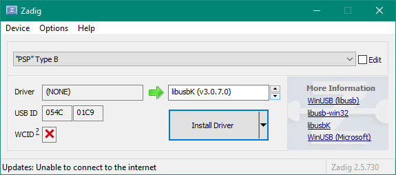

# CWUSB - How to use

## Linux
1. Copy [AdHocToUSB.prx](https://github.com/plus11/adhoctousb-guide/tree/main/AdhocToUSB) to /SEPLUGINS on the PSP
2. Create or open /SEPLUGINS/GAME.TXT
3. Add 

   ```ms0:/seplugins/AdhocToUSB.prx 1``` (for PSP 1000/2000/3000) 

   or 

   ``` ef0:/seplugins/AdhocToUSB.prx 1``` (for PSP GO)
\
   ```bash
   touch /media/username/nameofPSP/SEPLUGINS/GAME.TXT \
   && echo "ms0:/seplugins/AdhocToUSB.prx 1" \
   >> /media/username/nameofPSP/SEPLUGINS/GAME.TXT
   ```

4. Start a game on the PSP
5. Start [XLink Kai](http://teamxlink.co.uk/) on the PC
    1. Follow steps on [XLink Kai Debian Guide](https://repo.teamxlink.co.uk/) or download the binary from the [download page](https://www.teamxlink.co.uk/go?c=download), after downloading: 
    
       ```bash
       tar xvf kaiEngine-*.tar.gz \
       && cd "$(ls -f | grep kaiEngine | grep -v *.tar.gz)" \
       && sudo chmod 755 ./kaiengine \
       && sudo setcap cap_net_admin,cap_net_raw=eip ./kaiengine \
       && ./kaiengine
       ```
6. Start CWUSB 
   ```bash
   sudo chmod 755 ./cwusb && sudo ./cwusb
   ```
7. Enter the arena on XLink Kai you want to play on [WebUI](http://127.0.0.1:34522/) and enjoy!

\newpage

## Windows 
1. Copy [AdHocToUSB.prx](https://github.com/plus11/adhoctousb-guide/tree/main/AdhocToUSB) to \\SEPLUGINS on the PSP
2. Create or open \\SEPLUGINS\\GAME.TXT
3. Add

   ```ms0:/seplugins/AdhocToUSB.prx 1``` (for PSP 1000/2000/3000) 

   or 

   ``` ef0:/seplugins/AdhocToUSB.prx 1``` (for PSP GO)

4. Start a game on the PSP
5. Download [Zadig](https://zadig.akeo.ie/) and install the libusbK driver:



(note: if you do not see the psp, try going to Options->List all Devices)


6. Start [XLink Kai](http://teamxlink.co.uk/) on the PC
    1. Download [here](https://www.teamxlink.co.uk/go?c=download)
    2. Install XLink Kai by running the downloaded exe
    3. Run XLink Kai, by hitting Start and searching for 'Start XLink Kai'
7. Start CWUSB
8. Enter the arena on XLink Kai you want to play on [WebUI](http://127.0.0.1:34522/) and enjoy!
